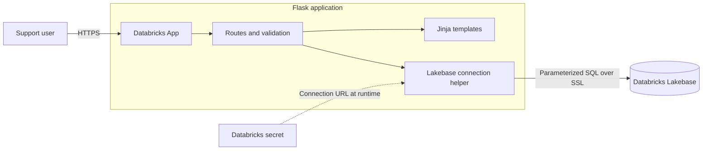
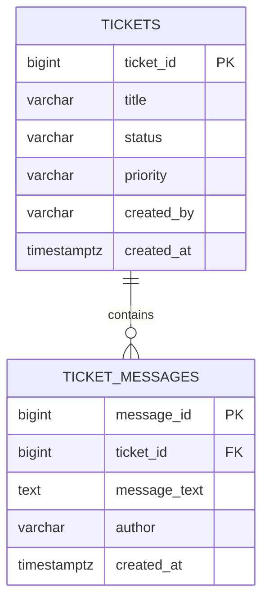
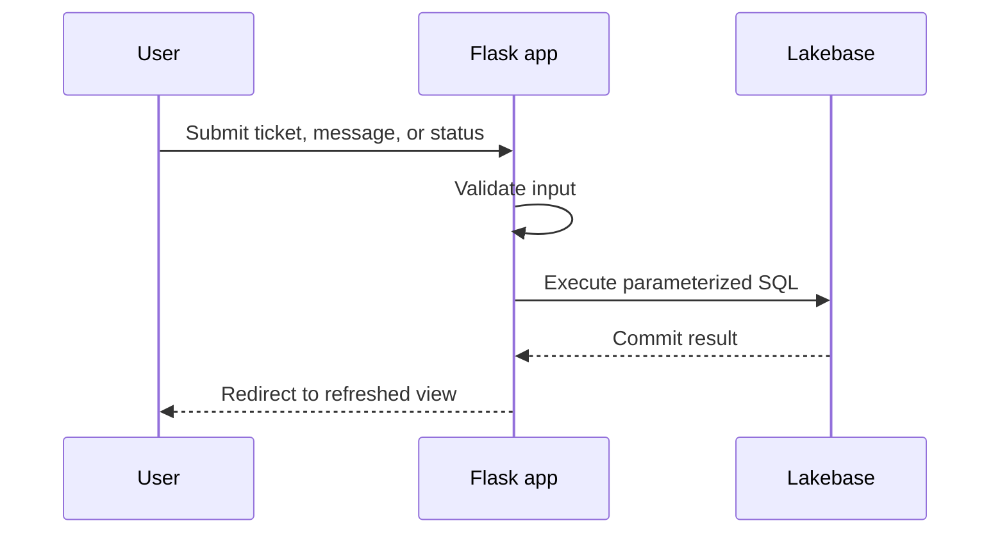

# Lakebase Support Desk

Lakebase Support Desk is a small operational support-ticket application built for Databricks Apps. It provides a clean interface for creating tickets, following conversations, and managing ticket status while storing all application data in Databricks Lakebase.

The project is intentionally compact: a Flask server renders the interface, parameterized SQL handles application queries, and PostgreSQL constraints protect the data model.

## Features

- View all support tickets and their message counts
- Filter tickets by `open`, `in_progress`, or `resolved`
- Open a ticket to read its full conversation history
- Create tickets with title, creator, and priority
- Add messages to existing tickets
- Update ticket status
- Display total and status-level ticket statistics
- Validate required fields and accepted status/priority values
- Preserve records across refreshes and application deployments
- Seed a demonstration dataset when the database is initially empty
- Adapt the interface to desktop and mobile screen sizes

## Architecture



The browser communicates with a Flask application hosted by Databricks Apps. Flask validates each request and executes parameterized SQL against Lakebase. The database connection URL is resolved from a Databricks secret at runtime and is never stored in the repository.

## Data model



Each message belongs to exactly one ticket through `ticket_messages.ticket_id`. The foreign key prevents orphaned messages, while `ON DELETE CASCADE` keeps related records consistent if ticket deletion is added later. Check constraints restrict status and priority to the values supported by the interface.

## Request flow



## Technology

| Layer | Technology | Responsibility |
| --- | --- | --- |
| Hosting | Databricks Apps | Runs and exposes the web application |
| Backend | Python and Flask | Routing, validation, rendering, and database operations |
| Database | Databricks Lakebase (PostgreSQL) | Transactional ticket and message storage |
| Database driver | psycopg2 | PostgreSQL connections and parameterized queries |
| Secrets | Databricks secret scopes | Supplies the database URL at runtime |
| Frontend | Jinja, HTML, and CSS | Responsive server-rendered interface |

## Repository structure

```text
.
├── app.py                 # Routes, validation, schema initialization, seed data
├── lakebase.py            # Secure Lakebase connection helper
├── app.yaml               # Databricks Apps command and environment configuration
├── requirements.txt       # Python dependencies
├── .env.example           # Safe local configuration template
├── static/
│   └── styles.css         # Responsive application styling
└── templates/
    ├── base.html          # Shared page shell and notifications
    ├── index.html         # Ticket list, filters, statistics, creation form
    └── ticket.html        # Conversation view and ticket update forms
```

## Application operations

| Method | Path | Purpose |
| --- | --- | --- |
| `GET` | `/` | List tickets, status filters, and statistics |
| `GET` | `/tickets/<ticket_id>` | Display one ticket and its messages |
| `POST` | `/tickets` | Create a ticket |
| `POST` | `/tickets/<ticket_id>/messages` | Add a message |
| `POST` | `/tickets/<ticket_id>/status` | Update ticket status |
| `GET` | `/healthz` | Return application health information |

## Database initialization

At application startup, `initialize_database()` performs three idempotent operations:

1. Creates the two tables and message lookup index with `IF NOT EXISTS`.
2. Checks whether the `tickets` table contains any rows.
3. Inserts three tickets and two messages per ticket only when the table is empty.

Existing records are not replaced during restarts or redeployments.

## Deploy to Databricks Apps

### Prerequisites

- A Databricks workspace with Databricks Apps and Lakebase available
- A Lakebase database and a role permitted to connect and create objects in the target schema
- A PostgreSQL connection URL stored in a Databricks secret
- Permission for the deployed application identity to read that secret

The default configuration expects:

| Setting | Value |
| --- | --- |
| Secret scope | `database` |
| Secret key | `lakebase-url` |

To use different names, update `LAKEBASE_SECRET_SCOPE` and `LAKEBASE_SECRET_KEY` in `app.yaml`. Do not place the connection URL itself in that file.

### Deployment

1. Import or clone this repository into a Databricks Git folder.
2. Create a Custom app from the Databricks Apps interface.
3. Select the repository folder containing `app.py` and `app.yaml` as the source.
4. Grant the application identity access to the configured secret and Lakebase database.
5. Deploy the app and inspect its logs until startup completes.
6. Open the generated application URL and create a ticket to verify write access.

The application listens on the port supplied by `DATABRICKS_APP_PORT`, defaulting to port `8000` for local use.

## Run locally

Create an isolated Python environment and install the dependencies:

```bash
python -m venv .venv
source .venv/bin/activate
pip install -r requirements.txt
cp .env.example .env
```

Set `LAKEBASE_URL` in the untracked `.env` file, then start the application:

```bash
python app.py
```

Open [http://localhost:8000](http://localhost:8000). Local execution writes to the database specified by `LAKEBASE_URL`; use a development database when production data must remain isolated.

## Verify the database

These queries can be run from a Lakebase-compatible SQL editor:

```sql
SELECT *
FROM tickets
ORDER BY ticket_id;

SELECT *
FROM ticket_messages
ORDER BY ticket_id, created_at;
```

To summarize ticket activity:

```sql
SELECT
    t.ticket_id,
    t.title,
    t.status,
    t.priority,
    COUNT(m.message_id) AS message_count
FROM tickets AS t
LEFT JOIN ticket_messages AS m
    ON m.ticket_id = t.ticket_id
GROUP BY t.ticket_id
ORDER BY t.created_at DESC;
```

## Security notes

- Never commit `.env`, passwords, connection URLs, API keys, or access tokens.
- Keep `sslmode=require` in the PostgreSQL connection URL.
- Grant the application identity only the database and secret permissions it needs.
- User-provided SQL values are passed separately from SQL statements through psycopg2 parameters.
- The application uses server-side validation in addition to browser form constraints.

## Possible extensions

- User authentication and ticket ownership
- Agent assignment and team queues
- Categories, tags, and service-level targets
- Search and pagination
- File attachments
- Email or Slack notifications
- Audit history for status changes
- Soft deletion with a confirmation workflow
- AI-generated ticket summaries and suggested responses
- Lakebase Change Data Feed into analytics dashboards

## Troubleshooting

| Symptom | What to check |
| --- | --- |
| App fails during startup | Confirm the secret exists and the app identity can read it |
| PostgreSQL connection or SSL error | Verify the complete connection URL and `sslmode=require` |
| Permission denied while creating tables | Grant `CREATE` for the target schema or initialize the schema as its owner |
| Tickets load but writes fail | Check the role's `INSERT` and `UPDATE` permissions |
| Changes disappear after refresh | Confirm the app is connected to Lakebase rather than temporary or hard-coded data |

## License

No license has been selected. Add a license before redistributing or accepting external contributions.